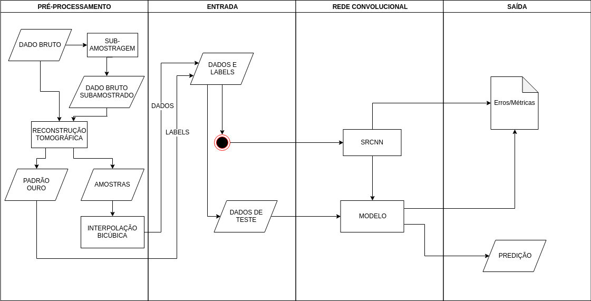

# ia369z

## Environment

This work was mostly developed and executed within the following environment settings:

```
Python 3.6.5

pip 9.0.1 from /usr/lib/python3/dist-packages (python 3.6)

Distributor ID:	Ubuntu
Description:	Ubuntu 18.04 LTS
Release:	18.04
Codename:	bionic

Docker version 17.12.1-ce, build 7390fc6
```

## Data

[](https://mybinder.org/v2/gh/ferseiti/reproducibility/master)

The data being read within data_management.ipynb, for now, can be found at:
https://figshare.com/s/c6fc5e1fdb95999c9402

All the files from the url above with h5 extension should be downloaded into
the directory data/ia369z/Palito/

The reconstructed tomographies can be found at the following url:
https://figshare.com/projects/ia369z/64340
The data above should be downloaded into the directory data/ia369z/Palito/recon

## Dependencies

Please set your environment to run on Python3, since this project was written
and tested to run under Python3.

You might need to install the following dependencies in order to run this
project:

- scikit-image
- numpy
- h5py
- matplotlib
- scipy==1.1.0
- tensorflow
- keras
- opencv-python
- requests

In order to install them, you can simply run:
```
pip3 install -v requests numpy h5py matplotlib tensorflow keras opencv-python scikit-image scipy==1.1.0
```

## Running the paper

One must start an instance of jupyter notebook on the root directory of their local copy of this repository.
Then, change directory to 'deliver' and open the file Final_Version.ipynb.
From then on, the notebook should run.

## What the notebook executes

The notebook named Final_Version.ipynb runs the report of the experiments on the data and displays some of the predictions, as well as the ground truth of the test data.

The slice from where the prediction will run can be chosen. An additional of 50 slices will then be also included in the prediction and visualization of the result.

## Docker

This work can be executed in a docker environment, with no previous dependencies, other than docker-ce (or docker.io) on your machine. Be aware, though, that in any case, this implementation is very demanding on the hardware.

In order to run in a docker, with docker installed on your machine, this can be run like so:

```
docker run -it --rm -p 12345:8888 -v $PWD:/home ferseiti/jupyter:reproducible
```

Then, just access, through your browser, the address http://localhost:12345.

Note that the port 12345 can be changed if 1234 is already in use by your OS.

## Workflow


